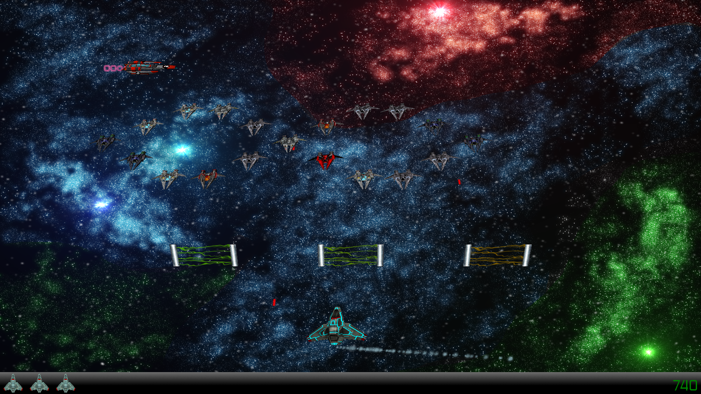

# Hyperspace Pirates - Aliens Robbing Rum :space_invader: :beer: :video_game:
This is a remake of the classical arcade game "Space Invaders" with modern 3D graphics and some special features like power-ups,
XBox 360 controller support and even an intro video. Its original hosting site is on
[SourceForge](https://sourceforge.net/projects/studi-invaders/) and this serves as a mirror.

## Ingame Screenshot

## Design Phase Architecture / Class Diagram

## How to Play
If you do not want to compile the code yourself, the latest compiled version may be found in the
[releases section](https://github.com/DominikSauter/SpaceInvadersRemake/releases). Just unzip it
and start `SpaceInvadersRemake.exe` in the main folder.

_\- So grab ye rum an' show those planet lubbers who's the real cap'n! Arrrrr!_

### Prerequisites
The game was developed using C#, Microsoft Visual Studio 2010 and XNA Game Studio 4.0. To run it you need:
  * Windows XP or newer
  * DirectX 10
  * XNA 4.0
  * .NET 4 framework
  
## Authors
This game was developed by six students as the practical software development project at the Karlsruhe Institute
of Technology (KIT), Germany:
  * Anjela Mayer
  * Christian Klotz
  * Dominik Sauter
  * Dominik Schaufelberger
  * Steffen Stehmann
  * Tobias Bast
